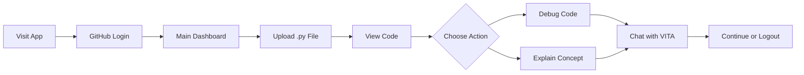

# VITA Features and Functionality: What Actually Exists

*A factual documentation of implemented features in VITA Panel Testing*  
*Date: 2025-08-21*  
*Based on codebase analysis, not speculation*

---

## System Overview

VITA Panel Testing is a **Python-based educational web application** that provides AI-assisted code debugging and programming concept exploration through a local language model integration.

---

## Implemented Features

### 1. Authentication System

#### GitHub OAuth 2.0 Integration
- **Status:** ✅ Fully Implemented
- **Module:** `auth.py`
- **Functionality:**
  - OAuth authorization flow with GitHub
  - User profile retrieval from GitHub API
  - Session token management
  - Automatic redirect handling
  - Logout capability

**User Flow:**
```
Login Button → GitHub Authorization → Callback → User Dashboard
```

**Technical Details:**
- Uses Authlib for OAuth handling
- Requires GitHub OAuth App credentials
- Stores user info in session (name, avatar URL)
- No persistent user storage

---

### 2. File Upload and Processing

#### Python File Upload System
- **Status:** ✅ Implemented
- **Module:** `file_uploader.py`
- **Supported Files:** Python (.py) files only
- **Features:**
  - Drag-and-drop or click-to-upload interface
  - UTF-8 file decoding
  - Line number generation
  - Syntax-preserved display
  - Real-time file preview

**Processing Pipeline:**
```python
Upload → Decode (UTF-8) → Add Line Numbers → Display
```

**Limitations:**
- Single file at a time
- No file editing capabilities
- No file persistence (memory only)
- No support for other languages

---

### 3. AI-Powered Assistance

#### Local LLM Integration
- **Status:** ✅ Implemented
- **Module:** `llm_connect.py`
- **Model:** TinyLlama-1.1B (via LM Studio)
- **Endpoint:** `http://localhost:1234/v1/chat/completions`

**Capabilities:**
- Code debugging assistance
- Programming concept explanations
- Interactive Q&A about uploaded code
- Contextual responses based on file content

**Technical Implementation:**
- HTTP REST API communication
- 500-second timeout for responses
- Asynchronous callback mechanism
- JSON message formatting

---

### 4. User Interface Components

#### Main Dashboard
- **Status:** ✅ Implemented
- **Framework:** Panel (Holoviz)

**Components:**
1. **Header Section**
   - User avatar display
   - Username from GitHub
   - Logout button

2. **File Upload Widget**
   - Visual upload area
   - File type validation
   - Upload status indicator

3. **Code Display Panel**
   - Line-numbered code view
   - Syntax highlighting
   - Scrollable container

4. **Chat Interface**
   - Message history display
   - VITA assistant with 🧠 emoji
   - User message input
   - Async response handling

5. **Action Buttons**
   - "Debug the uploaded code"
   - "Explain a concept"
   - "Open URL in browser"
   - "Logout"

---

### 5. Educational Features

#### Programming Concepts Dropdown
- **Status:** ✅ Implemented
- **Location:** Main interface

**Available Concepts:**
- Variables and data types
- Control structures (if/else, loops)
- Functions and scope
- Object-oriented programming
- Error handling
- File I/O operations
- Data structures (lists, dictionaries)
- Modules and packages
- Decorators
- Generators and iterators
- Context managers
- Regular expressions
- Testing and debugging
- Performance optimization
- Best practices and PEP 8

#### Debug Assistance
- **Status:** ✅ Implemented
- **Trigger:** "Debug the uploaded code" button
- **Function:** Analyzes uploaded Python code for issues
- **Output:** Explanations and suggestions via chat

#### Concept Explanation
- **Status:** ✅ Implemented
- **Trigger:** "Explain a concept" button + dropdown selection
- **Function:** Provides detailed explanations of Python concepts
- **Output:** Educational content via chat interface

---

## System Workflows

### Primary User Journey



### Data Flow

```
User Input → Application State → LLM Processing → Response Display
     ↑                                                    ↓
     └──────────────── Feedback Loop ────────────────────┘
```

---

## Technical Architecture

### Technology Stack

| Layer | Technology | Purpose |
|-------|------------|---------|
| **Frontend** | Panel 1.7.1 | Interactive web UI |
| **Authentication** | Authlib 1.6.0 | GitHub OAuth |
| **AI Integration** | HTTP/REST | LLM communication |
| **File Processing** | Python stdlib | File handling |
| **Async Operations** | asyncio/httpx | Non-blocking I/O |
| **Configuration** | python-dotenv | Environment management |

### System Requirements

**Server Side:**
- Python 3.8+
- Virtual environment
- Required packages from `requirements.txt`
- Environment variables for OAuth

**Client Side:**
- Modern web browser
- JavaScript enabled
- GitHub account for authentication

**AI Backend:**
- LM Studio or compatible server
- TinyLlama model loaded
- Port 1234 available

---

## Feature Comparison Matrix

| Feature | Implemented | Planned | Not Implemented |
|---------|-------------|---------|-----------------|
| GitHub Authentication | ✅ | | |
| File Upload (.py) | ✅ | | |
| Line Numbering | ✅ | | |
| AI Chat Interface | ✅ | | |
| Debug Assistance | ✅ | | |
| Concept Explanation | ✅ | | |
| Local LLM | ✅ | | |
| Code Execution | | | ❌ |
| Multi-file Support | | | ❌ |
| File Editing | | | ❌ |
| Cloud AI | | | ❌ |
| Collaboration | | | ❌ |
| Testing Framework | | | ❌ |
| Version Control | | | ❌ |
| Other Languages | | | ❌ |

---

## Actual Capabilities Summary

### What VITA Can Do:
1. **Authenticate users** via GitHub OAuth
2. **Accept Python file uploads** for analysis
3. **Display code** with line numbers
4. **Provide AI assistance** for debugging
5. **Explain programming concepts** interactively
6. **Maintain chat conversations** during session
7. **Handle asynchronous** LLM interactions

### What VITA Cannot Do:
1. **Execute code** or run tests
2. **Edit files** or save changes
3. **Support multiple files** or projects
4. **Work with non-Python** languages
5. **Persist data** between sessions
6. **Collaborate** with other users
7. **Work without local LLM** server

---

## Performance Characteristics

### Response Times
- **File Upload:** Instant (<100ms)
- **GitHub Auth:** 2-5 seconds
- **LLM Response:** 5-30 seconds typical
- **Max Timeout:** 500 seconds

### Scalability
- **Concurrent Users:** Limited by local LLM
- **File Size Limit:** Browser-dependent
- **Session Duration:** Until logout/close

### Reliability
- **Uptime:** Dependent on local services
- **Error Recovery:** Basic with fallbacks
- **Data Loss:** Possible (no persistence)

---

## Conclusion

VITA Panel Testing is a **functional prototype** that successfully demonstrates AI-assisted programming education through local deployment. It implements core features for code upload, analysis, and interactive learning while maintaining simplicity and privacy through local-first architecture.

The feature set is deliberately constrained to essential functionality, avoiding complexity in favor of a clear, focused user experience. This is not a limitation but a design choice aligned with the educational philosophy of the platform.